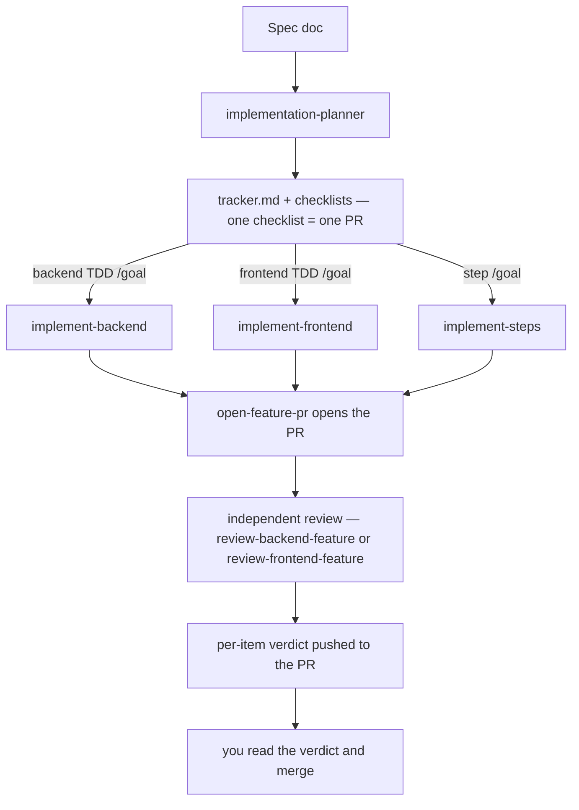

# jig

## What jig is

Jig is a Claude Code plugin that turns a spec into tested, reviewed pull requests. You write the spec. Jig splits it into checklists, builds each checklist test-first, reviews the diff against fixed standards, and opens the PR. The name comes from the factory tool: a jig guides the work so two builders produce the same part.

## Jig is opinionated

Jig ships one code structure and one set of rules. The `structure` skill owns where every file lives, and the standards skills own how each layer is written. The rules win over the code in the repo — existing code is never a precedent.

- **New project:** works from the first PR. Every file lands in jig's structure.
- **Existing project:** jig works, but it moves your code toward its structure — it does not adapt to yours. A surface that violates the rules gets reworked through a step checklist.

Every skill loads on its own with `/jig:<skill>`. This table shows which ones carry the structure opinion. A **No** row is safe in isolation — it never moves your files. A **Partly** row applies its rules without touching your structure, but its setup reference names jig's paths.

| Skill | Imposes jig's structure? |
| --- | --- |
| `structure` | Yes — it is the structure. |
| `backend-standards` | Yes — places every file by the structure tree. |
| `frontend-standards` | Yes — places every file by the structure tree. |
| `implement-backend` | Yes — the lane preloads the structure skill. |
| `implement-frontend` | Yes — the lane preloads the structure skill. |
| `implement-steps` | Yes — the lane preloads the structure skill. |
| `review-backend-feature` | Yes — the review walks the structure tree over the diff. |
| `review-frontend-feature` | Yes — the review walks the structure tree over the diff. |
| `implementation-planner` | Yes — it writes `docs/<project>/`, and its checklists run the lanes above. |
| `backend-tests` | Partly — the test-quality rules are structure-free; the harness setup expects tests in `features/**/{api,db}/__tests__/`. |
| `frontend-tests` | Partly — the test-quality rules are structure-free; the harness setup expects tests in `features/**/ui/__tests__/`. |
| `open-feature-pr` | No — branch, title, and body conventions only. |
| `skill-audit` | No — it audits skills, not your code. |

## Tech stack

Jig's standards and recipes target one stack:

- Next.js (App Router)
- tRPC
- Drizzle ORM + PostgreSQL
- TanStack Query v5
- shadcn/ui + Tailwind CSS
- Vitest — PGlite for backend tests, jsdom + MSW for UI tests

## How to install

Run these three commands in Claude Code:

```text
/plugin marketplace add Njunge11/jig
/plugin install jig@mita-labs-plugins-official
/reload-plugins
```

To try it without installing, start Claude Code from this repo with `claude --plugin-dir ./plugins/jig`.

## How to use

The workflow, end to end:



Example: your spec is `docs/growth/spec.md`.

1. **Plan.** Run `/jig:implementation-planner docs/growth/spec.md`. The planner audits the repo, asks you about the spec's open decisions, then writes `docs/growth/tracker.md` and one checklist per PR. Each tracker row carries a `/goal` run command.
2. **Build.** Copy one checklist's `/goal` command from the tracker and run it. The command starts the right lane — `implement-backend`, `implement-frontend`, or `implement-steps` — and keeps it working until every Done item is proven in the transcript. The lane builds test-first, opens the PR, and runs an independent review that reports a per-item verdict.
3. **Merge.** Read the PR and the review verdict, then merge.

You can also invoke any skill directly with `/jig:<skill>` — for example `/jig:frontend-standards` loads the frontend rules while you work by hand. Skills also load automatically when your task matches their descriptions.

## License

MIT
